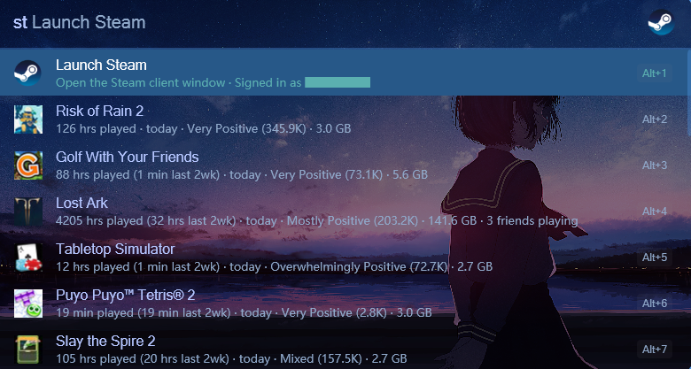

# Steam Launcher

<p align="center">
  
</p>

<p align="center">
  
  
  
  
</p>

### A native C# Steam plugin for [Flow Launcher](https://www.flowlauncher.com/)

Launch games, search the store, manage friends, switch accounts, set status, and find shared multiplayer games — all from one keystroke.



## Commands

```
st                       List installed games (sorted by recently played)
st <name>                Filter library, falls through to store search
st api                   Configure Steam Web API key + Steam ID (guided wizard)
st me                    Profile summary (level, owned, playtime)
st new                   Owned games never played
st friends               Online friends, favorites pinned
st friends <name>        Filter friends by name
st status                Set status: Online / Invisible / Offline
st switch                Switch the active Steam account
st multi <friend>        Shared multiplayer games with a friend
st verify [name]         Verify integrity of a game's files
st uninstall [name]      Uninstall an installed game
st settings              Open the Steam settings window
st downloads             Open the Steam download manager
```

## Features

### Local library

- `st` lists installed Steam games sorted by most recently played
- `st <name>` fuzzy-filters the library by title
- Installed games render first while Steam metadata, friends-playing info, and store results load in the background
- Launches installed games directly via Steam (handles update-then-launch automatically)
- Each row shows: playtime · last 2 weeks playtime · last-played · review summary · install size · update-status badge
- Surfaces "(N friends playing)" when any of your friends are currently in that game
- Game, friend, profile, multiplayer, and account rows include concise preview-panel details

### Steam Store search

- `st <name>` falls through to the Steam Store when the term doesn't match an installed game (up to 10 combined results)
- Shows review summary · price · discount · release date · developer
- Owned-but-not-installed rows route directly to your library page

### Friends

- `st friends` lists online friends sorted in-game / online / offline, with status emoji + current game
- `st friends <name>` fuzzy-filters by persona name
- Favorites are pinned to the top with a ⭐ marker
- Enter on a friend opens DM (Steam comes to the foreground via the AttachThreadInput trick)
- Right-click for the full context menu

### Adaptive context menu

Right-click any row to open the context menu. Items adapt to what the row represents:

- **On an installed game:** Launch · Open store · Community guides · Community discussions · Game properties · Uninstall · Open game folder
- **On a store game:** Open store · Community guides · Community discussions
- **On a friend:** DM · Invite to game · Join game · Open profile · Favorite/Unfavorite (refreshes the list in place)

### Multiplayer planning

- `st multi <friend>` lists games BOTH of you own that have multiplayer/co-op category tags (Multi-player, Co-op, MMO, Online PvP, Online Co-op, LAN, Shared/Split Screen, Cross-Platform)
- Row 0 is the friend's overview (avatar, status, current game)
- If the friend is currently in one of the shared games, that game gets pinned to the top
- Game rows ordered by `min(your-last-played, friend-last-played)` descending

### Steam status

- `st status` shows three rows: Online / Invisible / Offline
- One click switches your status via Steam's URL scheme — instant, no Steam restart

### Account switcher

- `st switch` lists every Steam account saved on this PC, with the current account called out first
- Per-account avatars from Steam's local cache
- Selecting a different account → confirmation row → switch (kills Steam, rewrites `loginusers.vdf`, sets `AutoLoginUser` registry, relaunches Steam)
- Refuses to switch if a game is currently running

### Personal stats

- `st me` shows Steam level, owned-game count, total playtime, and recent activity
- `st new` lists owned games you've never played
- Enter on the profile row opens your Steam profile; Enter on the recent row opens the library

### Quick utilities

- `st verify [name]` runs a Steam integrity verification on a game (`steam://validate/<appid>`)
- `st uninstall [name]` opens Steam's uninstall prompt for an installed game (`steam://uninstall/<appid>`)
- `st settings` opens the Steam settings window directly
- `st downloads` opens the Steam download manager

### Steam Web API setup

> API key encrypted with Windows DPAPI, bound to the current user.

- `st api` is a guided wizard: get a key, paste it, set Steam ID (auto-detected from `loginusers.vdf` when possible)
- `st api <key>` saves the key; `st api id <steamid64>` saves the Steam ID
- Drives `st me`, `st new`, `st friends`, `st multi`, the friends-playing suffix on game rows, and the store's owned-detection cross-reference

## Installation

Grab the latest zip from [Releases](https://github.com/hyunwoo312/steam-launcher/releases/latest), unzip into `%appdata%\FlowLauncher\Plugins\`, and restart Flow Launcher.

## License

MIT
